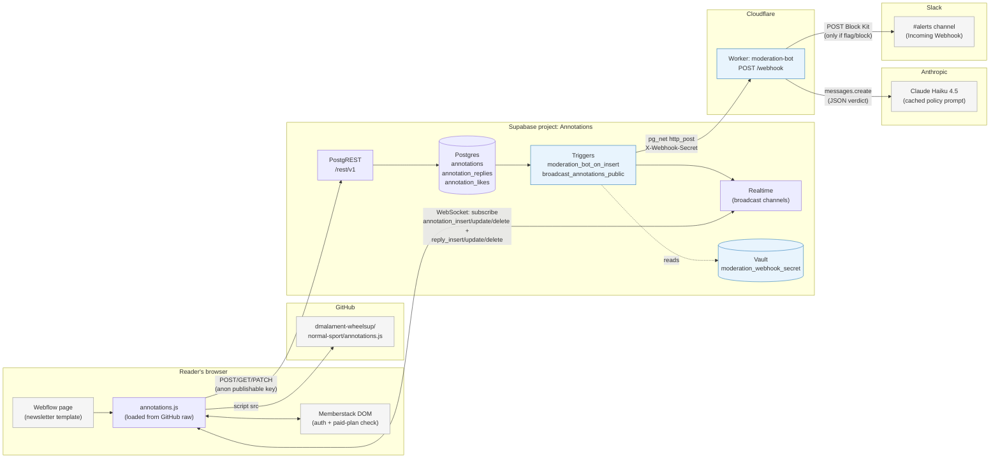

# Normal Sport — annotations system architecture

## Overview

Readers visiting a Normal Sport newsletter see an inline annotation layer. They can highlight text, add comments, like and reply. All persistence is in Supabase Postgres; updates propagate live across readers via Supabase Realtime broadcasts. New annotations and replies are screened by a content-moderation Cloudflare Worker that calls Claude and posts flagged content to Slack.

## Diagram

## Components

### Reader's browser

- **Webflow** hosts `normalsport.com`. Each newsletter edition uses a template that contains a `<script>` tag pointing at `annotations.js` on GitHub.
- **`annotations.js`** scans for `.ns-annotatable` wrappers, generates stable hash-based paragraph IDs, and renders the annotation UI.
- **Memberstack** gates write access. The script reads `window.$memberstackDom.getCurrentMember()` to check login state and paid-plan status. Logged-out users are redirected to `/login`; logged-in but unpaid users are redirected to `/become-a-member`.

### GitHub

- The `annotations.js` source lives in `dmalament-wheelsup/normal-sport`. Webflow loads it via the GitHub raw URL.

### Supabase (project `vnlrteehwvmloxfrgwcc`, "Annotations")

Three tables, all RLS-enabled, with the publishable anon key allowed to read/write through PostgREST policies:

- `public.annotations` — top-level annotations on a paragraph
- `public.annotation_replies` — threaded replies to an annotation
- `public.annotation_likes` — `(annotation_id, member_id)` composite PK

Triggers per table:

- `*_public_broadcast` — fans out INSERT/UPDATE/DELETE events to a Realtime broadcast channel so other readers' browsers update live.
- `moderation_bot_on_insert` (on `annotations` and `annotation_replies` only) — POSTs the new row to the Cloudflare Worker via `pg_net` with an `X-Webhook-Secret` header. Secret is stored in Supabase Vault.

### Cloudflare Worker — `moderation-bot`

- URL: `https://moderation-bot.david-malament.workers.dev/webhook`
- Verifies the shared secret in `X-Webhook-Secret` (constant-time compare).
- Returns `202 Accepted` immediately; runs moderation in `ctx.waitUntil` so the trigger never blocks on the model call.
- Calls Claude Haiku 4.5 with a cached system prompt (the moderation policy) and the row's text. Asks for JSON: `{ verdict, reason, categories }`.
- `verdict === "allow"` → silent no-op.
- `verdict === "flag" | "block"` → POST a Block Kit message to the Slack Incoming Webhook with table, row ID, categories, reason, and content excerpt.

### External services

- **Anthropic** — single `messages.create` call per insert. Prompt caching on the policy keeps cost ≈ flat across volume.
- **Slack** — single Incoming Webhook URL bound to one channel. Only flagged/blocked content arrives here.

## Auth and secrets

| Secret              | Lives in                                  | Used by                                |
| ------------------- | ----------------------------------------- | -------------------------------------- |
| Supabase anon key   | hardcoded in `annotations.js`             | Reader's browser → PostgREST/Realtime  |
| `WEBHOOK_SECRET`    | Worker secret + Supabase Vault            | Trigger → Worker auth                  |
| `ANTHROPIC_API_KEY` | Worker secret                             | Worker → Anthropic                     |
| `SLACK_WEBHOOK_URL` | Worker secret                             | Worker → Slack                         |

Rotating `WEBHOOK_SECRET` requires updating both the Worker secret (`wrangler secret put`) and the Vault entry. The other secrets only have one home.

## Data flow: one annotation, end to end

1. Reader highlights text in a newsletter and submits a comment.
2. `annotations.js` calls Memberstack to confirm the user is logged in and on a paid plan.
3. `annotations.js` does `POST /rest/v1/annotations` with the anon key.
4. Postgres inserts the row, then fires both AFTER INSERT triggers in the same transaction:
   - `annotations_public_broadcast` → Realtime → all subscribed browsers receive the new annotation and re-render.
   - `moderation_bot_on_insert` → `pg_net` queues a POST to the Worker (non-blocking from the writer's perspective).
5. Worker validates the secret, returns 202, and asynchronously calls Claude.
6. If Claude flags or blocks the content, the Worker posts to Slack. Otherwise the verdict is dropped on the floor.
